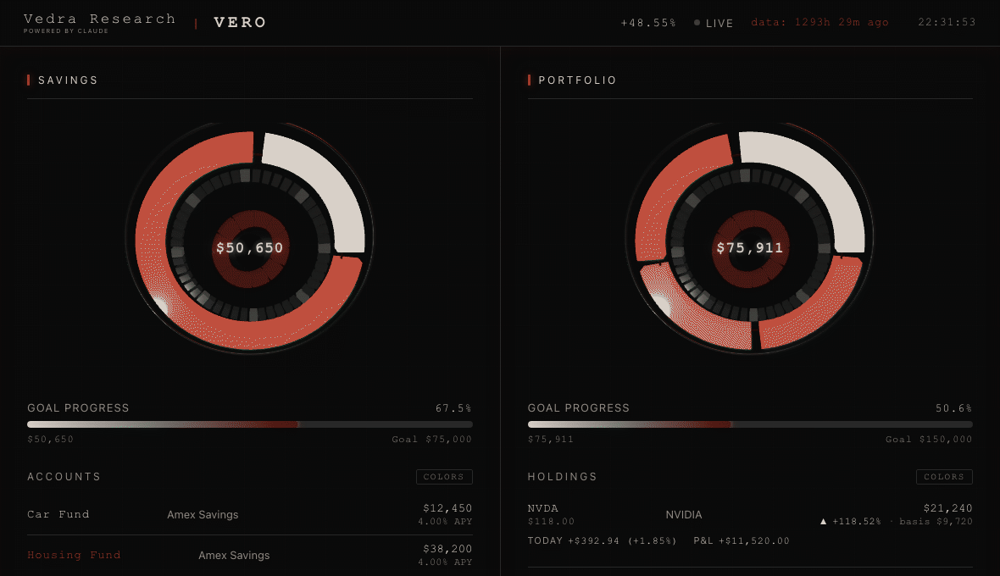

# Vero



> Wake up. Open terminal. Type `brief`.

<p align="center">
  <a href="https://github.com/Felixsavedra-1/investment-portfolio-analyzer/actions/workflows/ci.yml"></a>
  <a href="LICENSE"></a>
  
</p>

A local-first portfolio tracker that lives in your terminal and renders a live 3D web dashboard — no accounts, no cloud, no telemetry. It tracks positions, P&L, alpha vs SPY, and a full risk snapshot (Sharpe with Lo 2002 confidence intervals, volatility, max drawdown) entirely from data you keep on your own machine.

## Highlights

- **Academic-grade risk stats** — Sharpe ratios reported with Lo (2002) asymptotic 95% confidence intervals, plus volatility and max drawdown for the portfolio, the benchmark, and every position.
- **Trustworthy by construction** — 185 tests, all network-free, with `mypy` type-checking gated in CI on every push.
- **Server-less 3D dashboard** — Three.js allocation rings and animated sparklines, data injected at build time, opens as a single static HTML file with no backend.
- **Clean, layered architecture** — a single network module (yfinance), pure compute and render layers, and atomic JSON writes throughout.
- **Local-first** — all data stays in `~/.portfolio/`. No sign-up, no servers, no data leaves your machine.

**Stack:** Python · yfinance · pandas · Three.js · Claude AI

## Quick Start

```bash
portfolio buy AAPL 1000    # buy at live price
portfolio show             # positions + P&L
brief                      # morning brief + dashboard
```

Data lives in `~/.portfolio/`, created automatically on first use.

---

<details>
<summary><b>Install</b></summary>

Python 3.11

```bash
git clone https://github.com/Felixsavedra-1/investment-portfolio-analyzer.git
cd investment-portfolio-analyzer
sudo bash setup.sh
```

`sudo` required — the installer writes to `/usr/local/bin/`.

</details>

<details>
<summary><b>Commands</b></summary>

### Trades

```bash
portfolio buy   TICKER DOLLARS [--date YYYY-MM-DD] [--price P] [--notes "..."]
portfolio sell  TICKER DOLLARS [--date YYYY-MM-DD] [--price P]
portfolio show
portfolio gains   [--ticker TICKER]
portfolio history [--ticker TICKER] [--limit N]
portfolio remove  TICKER
```

`--date` backfills a trade at that day's closing price. Weekends and holidays resolve to the prior trading day.

### Savings

```bash
portfolio savings set    NAME BALANCE [--apy RATE] [--bank NAME]
portfolio savings remove NAME
portfolio savings interest
```

### Goals

```bash
portfolio goal set portfolio|savings AMOUNT
portfolio goal remove portfolio|savings
portfolio goal show
```

</details>

<details>
<summary><b>Morning Brief</b></summary>

Portfolio value, per-holding returns (1D / 1W / 1M / YTD), global index moves, watchlist momentum signals, and trailing 1Y risk — one command.

```
════════════════════════════════════════════════════════
  Vero  ·  Monday, April 20, 2026  8:02 AM ET
════════════════════════════════════════════════════════

  Ticker     Price    Wt      $P&L      1D       YTD
  ──────────────────────────────────────────────────
  NVDA     $118.20   33%  +$437.34  +1.85%  +42.10%
  AAPL     $199.50   22%   +$71.82  +0.45%  +14.30%
  AXP      $242.10   20%  +$178.67  +1.23%  +38.20%
  ──────────────────────────────────────────────────
  Portfolio    —       —   +$757.05  +1.05%  +25.60%
  S&P 500      —       —         —  +0.30%   +8.40%
  Alpha        —       —         —  +0.75%  +17.20%

  Risk (trailing 1Y)
  Sharpe 1.42 [0.98, 1.86]  ·  Vol 14.2%  ·  MDD -8.3%
```

</details>

<details>
<summary><b>Dashboard</b></summary>

3D allocation rings, animated sparklines, savings progress, goal tracking. Click any watchlist ticker for a live analysis panel — returns, volatility, drawdown, switchable price chart.

```bash
brief                  # brief + open dashboard
python dashboard.py    # dashboard only
```

</details>

<details>
<summary><b>Deep Analysis</b></summary>

CAGR, Sharpe with Lo (2002) 95% confidence intervals, volatility, and max drawdown — for the portfolio, benchmark, and each individual position. Saves a 6-panel chart to `~/.portfolio/portfolio_analysis.png`.

```bash
python portfolio_analyzer.py
```

</details>

<details>
<summary><b>Configuration</b></summary>

Create `config_local.py` in the project root (gitignored):

```python
WATCHLIST = {
    'JPM':  'JPMorgan',
    'NVDA': 'Nvidia',
}
BENCHMARK         = 'SPY'
RISK_FREE_RATE    = 0.045
MUTUAL_FUNDS      = frozenset({'SWPPX'})
```

| Setting | Default | Description |
|:---|:---|:---|
| `WATCHLIST` | `{}` | Tickers mapped to display labels |
| `MUTUAL_FUNDS` | `frozenset()` | NAV-lagged tickers, flagged `*` in the brief |
| `BENCHMARK` | `SPY` | Benchmark for alpha |
| `RISK_FREE_RATE` | `0.045` | Annual risk-free rate for Sharpe |
| `INTEREST_PAYMENT_DAY` | `None` | Day of month savings interest is credited |
| `BRIEF_TIMEZONE` | `America/New_York` | Timezone for the brief header |

</details>

<details>
<summary><b>Tests</b></summary>

185 tests, all network-free.

```bash
pytest tests/
```

</details>

---

<p align="center">
  
</p>
